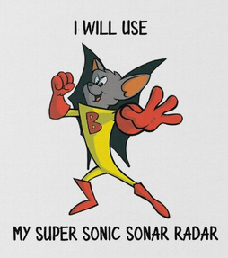

# BATFINK AUTONOMOUS ROBOT

## Introduction

This is the repo for the Y3 RDaC (Robot Design and Construction) project. The project is to design and build an autonomous robot that can navigate a maze and collect objects. The robot is to be based of the arduino nano 33 ble.

please contact me at jf1595(at)york(dot)ac(dot)uk for any questions.

